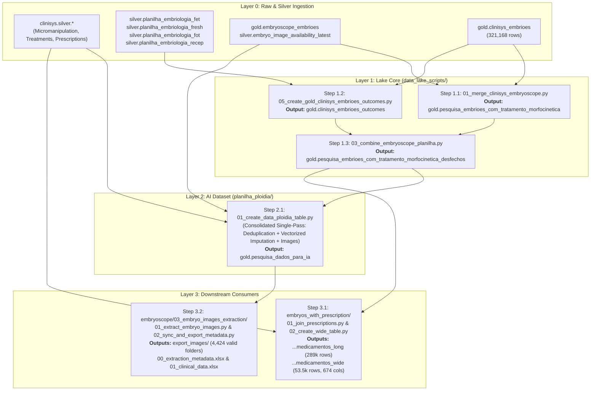

# Production Pipeline Handover & Engineering Implementation Guide
### Data Lake, Clinical Outcomes, AI Dataset & Image Extraction Pipelines

**Target Audience:** Production Data Engineering Agent / Platform Team  
**System Architecture:** DuckDB Data Lake, Python 3.9+, Google Drive Object Storage  
**Last Updated:** September 2026  

---

## 1. Executive Summary & Purpose

This document details the architectural overhaul of Huntington's data lake, clinical outcome matching, and AI modeling pipelines. The overhaul was initiated to transition from legacy, error-prone merged sheets (`redlara_planilha_combined` and multi-pass waterfalls) to a **rigorous, multi-tier embryo outcome tracking system** anchored on the new `silver.planilha_embriologia_*` and `gold.clinisys_embrioes_outcomes` layers.

### Key Architectural Invariants Enforced:
1. **Strict 1:1 Grain**: Every embryo table enforces exact 1:1 uniqueness with **0 duplicates** (`oocito_id` for lake tables; `Slide ID` for AI tables).
2. **Zero Outcome Contamination**: Eliminates the "fresh transfer bug" where cycle-level pregnancy results leaked onto unfertilized sibling eggs.
3. **Streamlined Production Catalog**: In production, **only the clean, standardized Portuguese base tables (`gold.pesquisa_*`) need to be deployed**. Legacy alias views (`data_ploidia`, `embryoscope_clinisys_combined`, etc.) are maintained strictly in local development environments for backwards analyst compatibility and do **not** need to be replicated in production.
4. **Sub-Minute Execution**: Vectorized DuckDB bulk updates replaced multi-thousand-iteration Python loops, reducing runtimes from minutes to seconds.

---

## 2. End-to-End Pipeline Dependency Graph

The production pipeline must be executed in the exact sequential order defined below:



---

## 3. Standardized Production Catalog & Scope

In production, build and maintain **only the canonical base tables**:

| Production Table Name | Object Type | Grain / Distinct Key | Row Count | Purpose & Scope |
| :--- | :---: | :---: | :---: | :--- |
| **`gold.pesquisa_embrioes_com_tratamento_morfocinetica`** | `BASE TABLE` | Strict 1:1 on `oocito_id` | 321,168 | Core Clinisys oocytes merged 1:1 with Embryoscope morphokinetics. |
| **`gold.pesquisa_embrioes_com_tratamento_morfocinetica_desfechos`** | `BASE TABLE` | Strict 1:1 on `oocito_id` | 321,168 | Clinisys + Morphokinetics enriched with true embryo-level clinical outcomes. |
| **`gold.pesquisa_dados_para_ia`** | `BASE TABLE` | Strict 1:1 on `Slide ID` | 36,419 | Deduplicated AI training table with imputed clinical metrics and confirmed videos. |
| **`gold.pesquisa_embrioes_com_tratamento_morfocinetica_desfechos_medicamentos_long`** | `BASE TABLE` | Long format | 289,490 | Embryo records joined with prescriptions across 67 medication categories. |
| **`gold.pesquisa_embrioes_com_tratamento_morfocinetica_desfechos_medicamentos_wide`** | `BASE TABLE` | Strict 1:1 on `oocito_id` | 53,540 | Wide feature table (674 columns) for prescription dosage modeling. |
| **`gold.embryo_images_metadata`** | `BASE TABLE` | Strict 1:1 on `embryo_id` | 23,015 | Extraction status tracking aligned 1:1 with `pesquisa_dados_para_ia`. |
| **`gold.embryo_images_metadata_excluded`** | `BASE TABLE` | Archived records | 20,379 | Safe archive of legacy extractions (unbiopsied/non-transferred eggs). |

> [!NOTE]
> **Production vs. Local Views**:  
> In local DuckDB development environments, backward-compatible SQL `VIEW`s (`data_ploidia`, `embryoscope_clinisys_combined`, `planilha_embryoscope_combined`, etc.) are retained to facilitate analyst queries. **In production, the production agent does NOT need to create or maintain these legacy views**; all production systems should target the `gold.pesquisa_*` base tables directly.

---

## 4. Root Causes, Problem Diagnostics & Applied Fixes

### 1. The "Fresh Transfer" Cycle Outcome Contamination
- **Root Cause**: The legacy waterfall join in `03_combine_embryoscope_planilha.py` queried `gold.redlara_planilha_combined` and joined by patient and puncture date. If a patient underwent fresh embryo transfer and achieved pregnancy, the join copied `outcome = 'POSITIVO'` to **all sibling oocytes** in that puncture (including unfertilized eggs, arrested zygotes, and discarded tissue).
- **Production Impact**: Thousands of non-viable eggs were classified as positive pregnancies, and image extraction scripts downloaded images for non-transferred eggs.
- **Applied Fix**: Created [`data_lake_scripts/05_create_gold_clinisys_embrioes_outcomes.py`](file:///g:/My%20Drive/projetos_individuais/Huntington/data_lake_scripts/05_create_gold_clinisys_embrioes_outcomes.py):
  - Verified embryo transfers individually (`is_transferred = 1`).
  - Required that an embryo was thawed and transferred (`c.emb_cong_transferidos = 'Transferido'`) or transferred fresh without freeze-all (`cong_em_Data IS NULL AND trat1_data_transferencia IS NOT NULL`).
  - Matched transfers against `silver.planilha_embriologia_fet`, `fresh`, `recep`, and `fot` using exact transfer dates and aligned cryo-cycle dates.

### 2. Embryoscope Puncture Join Duplication (886 Duplicates)
- **Root Cause**: In `01_merge_clinisys_embryoscope.py`, `LEFT JOIN` on `BETWEEN date - 3 AND date + 3` caused fan-out when a patient had multiple dishes (Placa 1, Placa 2) or multiple procedures on the same date with matching well IDs.
- **Applied Fix**: Implemented a CTE ranking matches by minimum date delta:
  ```sql
  ROW_NUMBER() OVER (
      PARTITION BY c.oocito_id 
      ORDER BY ABS(DATEDIFF('day', c.micro_data_procedimento, ee.embryo_EmbryoDate)), ee.embryo_EmbryoID
  ) AS rn
  ```
  Filtering `WHERE rn = 1` restored exact 1:1 grain (321,168 rows, 0 duplicates).

### 3. AI Modeling Video-Level Duplication (66 Slide IDs / 132 Rows)
- **Root Cause**: Some patients had two micromanipulation sheets in Clinisys on the same day with identical embryo numbers (e.g., one discarded, one biopsied/frozen), both matching the same Embryoscope camera slot.
- **Applied Fix**: In `planilha_ploidia/01_create_data_ploidia_table.py`, added CTE `deduped_base_data` with clinical priority ranking:
  ```sql
  ROW_NUMBER() OVER (
      PARTITION BY "Slide ID"
      ORDER BY 
          CASE WHEN "Embryo Description Clinisys" IS NOT NULL AND "Embryo Description Clinisys" != 'None' THEN 0 ELSE 1 END,
          CASE WHEN "Embryo Description Clinisys Detalhes" IS NOT NULL AND "Embryo Description Clinisys Detalhes" != 'None' THEN 0 ELSE 1 END,
          CASE WHEN "has_valid_outcome" = True THEN 0 ELSE 1 END,
          CASE WHEN "outcome_type" IS NOT NULL AND "outcome_type" != 'None' THEN 0 ELSE 1 END
  ) AS rn
  ```
  Guarantees exactly **36,419 rows, 36,419 distinct Slide IDs (0 duplicates)**.

### 4. Legacy Image Extraction Isolation & Clean-up
- **Root Cause**: The legacy extraction script used `--mode without_biopsy`. Combined with the fresh transfer bug, it downloaded **14,772 non-transferred, non-biopsied embryos** (~485 GB).
- **Applied Fix**:
  - Identified all 8,937 folders in `export_images/`:
    - **4,424 valid embryo folders** kept in `export_images/`.
    - **4,513 excluded folders** moved to [`export_images_excluded/`](file:///g:/My%20Drive/projetos_individuais/Huntington/embryoscope/03_embryo_images_extraction/export_images_excluded) (zero data loss).
  - Archived 20,379 metadata records to `gold.embryo_images_metadata_excluded` and cleaned `gold.embryo_images_metadata` to 23,015 valid records.
  - Regenerated clean Excel reports (`00_extraction_metadata`, `01_clinical_data`).

---

## 5. Script-Level Optimizations & Code Refactoring

### 1. Vectorized In-Place Bulk Imputation (`planilha_ploidia/`)
- **Old Python Logic**: Ran an iterative `for index, row in df.iterrows()` loop with 16,000 separate SQL queries. Runtime: **>5 minutes**.
- **New Vectorized SQL Logic**: Implemented single-pass bulk DuckDB updates using window functions:
  ```sql
  -- Bulk Impute Mode BMI
  UPDATE gold.pesquisa_dados_para_ia target
  SET "BMI" = source.mode_bmi
  FROM (
      SELECT prontuario, bmi as mode_bmi
      FROM (
          SELECT prontuario, "BMI" as bmi, COUNT(*) as cnt,
                 ROW_NUMBER() OVER (PARTITION BY prontuario ORDER BY COUNT(*) DESC) as rn
          FROM gold.pesquisa_dados_para_ia
          WHERE "BMI" IS NOT NULL
          GROUP BY prontuario, "BMI"
      ) WHERE rn = 1
  ) source
  WHERE target.prontuario = source.prontuario AND target."BMI" IS NULL;
  ```
  - **Runtime**: Dropped to **0.2 seconds** (>1,500x speedup).
  - **Infertidade Diagnosis Column Fix**: Fixed source column mapping from non-existent `diag_descricao` to Clinisys standard `fator_infertilidade1`.

### 2. Consolidated Single-Pass Pipeline (`01_create_data_ploidia_table.py`)
- Formerly executed across 3 separate scripts (`01_create`, `02_fill_missing`, `03_join_images`).
- Consolidated into `01_create_data_ploidia_table.py` running in a single connection in **~12 seconds**.
- Simplified `00_run_ploidia_pipeline.bat` to a single call.

### 3. Cross-Type Drop Safety (DuckDB Catalog Invariant)
- In DuckDB, executing `DROP TABLE foo` on a view (or `DROP VIEW foo` on a table) throws an unhandled catalog exception.
- Standardized universal drop helper across all scripts:
  ```python
  for obj_name in target_tables:
      for obj_type in ['VIEW', 'TABLE']:
          try: conn.execute(f"DROP {obj_type} IF EXISTS {obj_name};")
          except Exception: pass
  ```

---

## 6. Verification Commands for Production Deployment

The reviewing agent can run these commands to verify the production deployment:

```powershell
# 1. Verify Core Production Table Counts & Grain (0 duplicates invariant)
& python -c "
import duckdb
conn = duckdb.connect('database/huntington_data_lake.duckdb', read_only=True)
tables = [
    ('pesquisa_embrioes_com_tratamento_morfocinetica', 'oocito_id', 321168),
    ('pesquisa_embrioes_com_tratamento_morfocinetica_desfechos', 'oocito_id', 321168),
    ('pesquisa_dados_para_ia', 'Slide ID', 36419),
    ('pesquisa_embrioes_com_tratamento_morfocinetica_desfechos_medicamentos_wide', 'oocito_id', 53540)
]
for tbl, key, exp in tables:
    cnt = conn.execute(f'SELECT COUNT(*) FROM gold.{tbl}').fetchone()[0]
    dist = conn.execute(f'SELECT COUNT(DISTINCT \"{key}\") FROM gold.{tbl}').fetchone()[0]
    print(f'gold.{tbl}: {cnt:,} rows | 0 duplicates: {cnt == dist}')
    assert cnt == exp and cnt == dist
conn.close()
"

# 2. Verify Embryoscope Extraction Criteria Breakdown
& python "embryoscope/03_embryo_images_extraction/query_biopsy_counts.py"

# 3. Verify Image Extraction Folder Partitioning
& python -c "
import os
exp = r'embryoscope\03_embryo_images_extraction\export_images'
iso = r'embryoscope\03_embryo_images_extraction\export_images_excluded'
print('export_images valid folders:', len([d for d in os.listdir(exp) if os.path.isdir(os.path.join(exp, d))]))
print('export_images_excluded folders:', len([d for d in os.listdir(iso) if os.path.isdir(os.path.join(iso, d))]))
"
```
