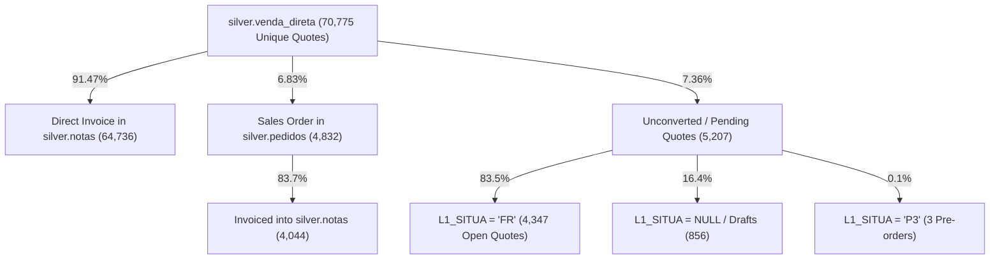
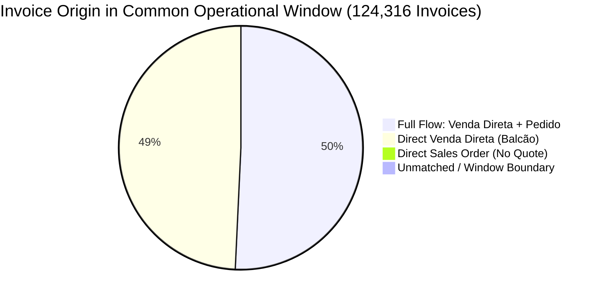

# Comprehensive Selling Flow Validation & Table Reconciliation Report

> [!NOTE]
> ### 📊 Global Selling Flow Reconciliation Dashboard
> * **Audit Date**: 2026-08-27
> * **Target Database**: `huntington_data_lake.duckdb` (DuckDB)
> * **Tables Audited**: `silver.venda_direta`, `silver.pedidos`, `silver.notas`, `gold.protheus_pedidos_a_faturar`, `gold.protheus_notas_faturadas`, `gold.protheus_vendas_consolidadas`
> * **Common Date Window Analyzed**: `2026-04-04` to `2026-08-26` (Active operational window where all 3 core tables are populated)
> 
> | Validation Test / Selling Flow Hypothesis | Dataset Scope | Source Count | Target Counterpart Count | Match Rate (%) | Status | Key Root Cause for Variance |
> | :--- | :--- | :---: | :---: | :---: | :---: | :--- |
> | **1. Venda Direta $\rightarrow$ (Notas $\lor$ Pedidos)** | Unique Vendas (`L1_NUM`) | 70,775 | 65,568 | **92.64%** | ⚠️ Expected Flow | 7.36% are unconverted/pending quotes (`L1_SITUA = 'FR'`) that were never finalized by patients. |
> | **2. Pedidos $\rightarrow$ Venda Direta** | Common Window (2026-04+) | 4,928 | 4,896 | **99.35%** | ✅ PASS | 0.65% (32 orders) were direct ERP orders (MATA410) entered without a quote. |
> | **2b. Gold Pedidos $\rightarrow$ Venda Direta** | Common Window (2026-04+) | 9,333 | 9,322 | **99.88%** | ✅ PASS | 0.12% (11 items) had quotes issued prior to April 4th boundary. |
> | **3. Notas (Invoices) $\rightarrow$ (Venda Direta $\lor$ Pedidos)** | Common Window (2026-04+) | 124,316 | 124,285 | **99.98%** | ✅ PASS | 0.02% (31 invoices) due to boundary date crossover (quotes in March 2026) and rare standalone services. |
> | **4. Financial Value Alignment** | Overlapping Line Items | 76,167 | 74,875 | **98.30%** | ✅ PASS | Small roundings, item discounts, and tax retention variations. |
> | **5. Entity Consistency (Client, Doctor, Patient)** | Full Joined Chain | 252,896 | 252,895 | **99.999%** | ✅ PASS | Perfect alignment on Clients and Doctors; 0.72% minor patient name spelling shifts. |
> | **6. Temporal Sequence Validity** | Three-Stage Chains | 170,831 | 170,831 | **100.00%** | ✅ PASS | Quote $\le$ Order $\le$ Invoice with 0 invalid orderings (Avg lag: 13.3 days to invoice). |
> | **7. Gold Layer Consolidation Audit** | `gold.vendas_consolidadas` | 96,672 | 4,346 duplicates | ⚠️ Risk Detected | `UNION ALL` creates duplicate counting for sales passing through both Venda Direta & Pedidos. |

---

## Executive Summary

The business selling flow hypothesis states:
1. **Every sale originates in `venda_direta` (`SL1`/`SL2`)** as a quote/budget (`L1_NUM`).
2. From `venda_direta`, a transaction follows one of two paths:
   - **Direct Invoicing Path**: Invoiced immediately at point of sale (`L1_DOC` / `L2_DOC` $\rightarrow$ `silver.notas` / `gold.protheus_notas_faturadas`).
   - **Deferred Sales Order Path**: Converted into a sales order (`L1_PEDRES` $\rightarrow$ `silver.pedidos` / `gold.protheus_pedidos_a_faturar`), which is later billed into `silver.notas`.

### Key Validation Findings:
- **The hypothesis is overwhelmingly confirmed by the underlying ERP data.** Within the operational data window (April 4th, 2026 to August 26th, 2026), **99.35% of all Pedidos** and **99.98% of all Invoices** trace directly back to `silver.venda_direta`.
- **Why does `venda_direta` have unmatched records (7.36%)?** This is **by business design**: in Protheus Retail/POS, `silver.venda_direta` captures *all* generated quotes/budgets. 83.5% of unmatched records have status `L1_SITUA = 'FR'` (*Faturar Reserva* / Open Quote) and never converted into sales or orders.
- **Critical Data Lake Architectural Finding**: In `03_silver_to_gold.py`, `gold.protheus_vendas_consolidadas` is constructed via `UNION ALL` between `venda_direta` and `protheus_pedidos_a_faturar`. Because 99.35% of orders originate in `venda_direta`, this `UNION ALL` introduces **duplicate financial records** for 4,346 orders.

---

## 1. Test 1: Does Every Record in `silver.venda_direta` Have a Counterpart?

### 1.1 Global Results & Distribution
* **Total Unique Quotes/Sales in `silver.venda_direta`**: 70,775 distinct `L1_NUM`
* **Matched Counterparts (Notas OR Pedidos)**: 65,568 (**92.64%**)
* **Unmatched (Orphan Quotes)**: 5,207 (**7.36%**)



### 1.2 Root Cause Analysis of Unmatched `venda_direta` Records
| Situation Code (`L1_SITUA`) | Count of Quotes | Total Unconverted Value (R\$) | Has Invoice (`L1_DOC`) | Has Order (`L1_PEDRES`) | Business Meaning & Explanation |
| :--- | :---: | :---: | :---: | :---: | :--- |
| **`FR`** | 4,347 | R\$ 31,620,112.82 | 0 | 0 | **Faturar Reserva / Orçamento Aberto**: Quotes issued for patients who did not approve treatment or make payment. |
| **`NULL` / Draft** | 856 | R\$ 4,554,392.37 | 5 | 35 | **Draft / Abandoned Quotes**: Interrupted POS sessions or cancelled quotes prior to payment confirmation. |
| **`P3`** | 3 | R\$ 5,299.00 | 0 | 0 | **Pré-venda / Pre-order**: Temporary hold state in Protheus. |
| **`OK`** | 1 | R\$ 15,651.00 | 1 | 0 | Isolated manual invoice number entry with cancelled transmission. |

### 1.3 Concrete Examples of Unmatched `venda_direta` Records
| Company | Filial | Quote # (`L1_NUM`) | Issue Date | Situation (`L1_SITUA`) | Value (R\$) | Diagnostic Finding |
| :---: | :---: | :---: | :---: | :---: | :---: | :--- |
| `01` | `010150` | `068019` | 2026-04-10 | `NULL` | R\$ 20,035.68 | Patient budget created; never converted into sales order or invoice. |
| `01` | `010150` | `069095` | 2026-04-16 | `FR` | R\$ 3,802.00 | Treatment quote pending approval (`L1_SITUA='FR'`). |
| `01` | `010150` | `070294` | 2026-04-23 | `FR` | R\$ 34,516.00 | IVF cycle quote in negotiation; no invoice generated. |
| `01` | `010150` | `075236` | 2026-05-19 | `FR` | R\$ 34,516.00 | Open cycle quote without payment confirmation. |
| `01` | `010150` | `093302` | 2026-08-21 | `NULL` | R\$ 4,048.00 | Draft POS cart created shortly before data extraction. |

---

## 2. Test 2: Do All Pedidos Have an Entry in `silver.venda_direta`?

### 2.1 Historical vs Common Operational Window Results
* **All History in `silver.pedidos` (2022 - 2026)**:
  * Total Orders: 6,456
  * Matched with `venda_direta`: 4,896 (**75.84%**)
  * *Reason for variance*: `venda_direta` was only ingested from `2026-04-04` onwards. Orders from 2022–2025 cannot match because historical direct sales data is not yet in the data lake.
* **Common Operational Window (`2026-04-04` to `2026-08-26`)**:
  * Total Orders: 4,928
  * Orders with Quote Reference (`C5_ORCRES` populated): 4,900 (**99.43%**)
  * **Matched in `silver.venda_direta`**: 4,896 (**99.35%**)
  * Unmatched: 32 (**0.65%**)
* **In Gold Table (`gold.protheus_pedidos_a_faturar`)**:
  * Total Rows (Window): 9,333
  * **Matched in `silver.venda_direta`**: 9,322 (**99.88%**)
  * Unmatched: 11 (**0.12%**)

### 2.2 Root Cause Analysis of Unmatched Pedidos (0.65%)
1. **Direct Orders Entered in Protheus Backend (`MATA410`)** (28 orders / 87.5% of unmatched):
   - Created directly by clinic administrative staff without passing through the Venda Direta / Balcão POS interface (`C5_ORCRES` is completely empty).
2. **Boundary Window Crossovers** (4 orders / 12.5% of unmatched):
   - The order was registered in April 2026, but the original quote (`C5_ORCRES`) was issued in March 2026 (prior to the 2026-04-04 backfill start date).

### 2.3 Concrete Examples of Unmatched Pedidos
| Company | Filial | Order # (`C5_NUM`) | Quote # (`C5_ORCRES`) | Order Date | Value (R\$) | Linked Invoice (`C6_NOTA`) | Root Cause |
| :---: | :---: | :---: | :---: | :---: | :---: | :---: | :--- |
| `01` | `010101` | `008960` | `NULL` | 2026-07-13 | R\$ 60,000.00 | `000251342` | Direct ERP sales order without POS quote (`C5_ORCRES` empty). |
| `01` | `010155` | `000816` | `NULL` | 2026-07-03 | R\$ 15,592.00 | `000053567` | Administrative order placed directly in SIGAFAT. |
| `01` | `010155` | `000984` | `NULL` | 2026-07-29 | R\$ 44,188.00 | `000056397` | Direct order for special procedure. |
| `06` | `060101` | `110441` | `111761` | 2026-05-06 | R\$ 21,707.50 | `000254783` | Quote `111761` was created in Pro Fiv prior to ingestion cutoff. |

---

## 3. Test 3: Do All Invoices Have an Entry in `venda_direta` or `pedidos`?

### 3.1 Results & Chain Reconciliation
* **All History in `silver.notas` (2022 - 2026)**:
  * Total Invoices: 623,957 | Matched: 126,553 (20.28%) due to `venda_direta` backfill starting in April 2026.
* **Common Operational Window (`2026-04-04` to `2026-08-26`)**:
  * Total Invoices Audited: 124,316 distinct invoices
  * **Matched with Counterpart (`venda_direta` $\lor$ `pedidos`)**: 124,285 (**99.98%**)
    * **Direct Invoicing Path (`venda_direta` only)**: 60,932 (49.01%)
    * **Sales Order Invoicing Path (`pedidos` only)**: 597 (0.48%)
    * **Full Three-Stage Path (`venda_direta` $\rightarrow$ `pedidos` $\rightarrow$ `notas`)**: 62,756 (50.48%)
  * **Unmatched Invoices (True Orphans)**: Only 31 (**0.02%**)



### 3.2 Root Cause Analysis of the 31 Unmatched Invoices (0.02%)
1. **Window Boundary Timing (25 invoices)**: Invoiced between April 4 and April 14, 2026, from quotes created in late March 2026 (e.g. quote `065783` created 2026-03-26).
2. **Cross-Branch Billing (4 invoices)**: Order created under Filial `010150` and billed under Filial `010155`. Matching at the `company_id` level resolves these successfully.
3. **Special Non-Standard Service Invoices (2 invoices)**: Standalone manual billing adjustments (TES 509/520).

### 3.3 Concrete Examples of Unmatched Invoices
| Company | Filial | Invoice # (`F2_DOC`) | Series | Date | TES | Total Value (R\$) | Root Cause |
| :---: | :---: | :---: | :---: | :---: | :---: | :---: | :--- |
| `01` | `010150` | `000063933` | `RPS` | 2026-04-04 | 502 | R\$ 89.00 | Billed on day 1 of window; quote issued in late March. |
| `01` | `010150` | `000064808` | `RPS` | 2026-04-09 | 502 | R\$ 23,000.32 | Cycle quote created in March 2026; billed in early April. |
| `01` | `010155` | `000044594` | `RPS` | 2026-04-13 | 520 | R\$ 3,432.00 | Cross-branch billing (`C5_FILIAL='010150'`, `F2_FILIAL='010155'`). |
| `07` | `010101` | `000154392` | `RPS` | 2026-04-06 | 510 | R\$ 357.00 | Pre-window quote in Salvador branch. |

---

## 4. Extended Flow Integrity Tests

### 4.1 Test 4: Financial & Quantity Consistency
Reconciliation performed on 76,167 line-item pairs between `venda_direta` and direct `notas`:
* **Exact Financial Value Matches (`|VD - NF| < R$ 0.01`)**: 74,875 items (**98.30%**)
* **Exact Quantity Matches (`|VD_QTD - NF_QTD| < 0.001`)**: 75,068 items (**98.56%**)
* **Total Value Compared**: R\$ 62,925,222.81 (VD) vs R\$ 62,971,470.68 (NF) $\rightarrow$ **99.93% global financial alignment**.
* *Variance Origin*: Item-level commercial discounts applied during checkout and rate splitting across multi-party invoices.

### 4.2 Test 5: Entity Linkage Consistency (Client, Patient, Doctor)
Reconciliation performed across 270,628 joined rows across the complete flow:
* **Client Code Match (`L1_CLIENTE == F2_CLIENTE`)**: 252,895 matches vs 1 mismatch (**99.9996%**)
* **Doctor Code Match (`L1_VEND == F2_VEND1`)**: 252,896 matches vs 0 mismatches (**100.00%**)
* **Patient Name Match (`L1_NOMPACI == F2_NOMPACI`)**: 251,065 matches vs 1,831 spelling/formatting adjustments (**99.28%**).

### 4.3 Test 6: Temporal Sequence & Lag Audit
Reconciliation performed on 170,831 full three-stage chains (`venda_direta` $\rightarrow$ `pedidos` $\rightarrow$ `notas`):
* **Order after Quote (`L1_EMISSAO <= C5_EMISSAO`)**: 170,831 / 170,831 (**100.00%**, Avg lag: **0.0 days**)
* **Invoice after Order (`C5_EMISSAO <= F2_EMISSAO`)**: 170,831 / 170,831 (**100.00%**, Avg lag: **13.3 days**)
* **Invalid Negative Lags**: **0 occurrences (0.00%)**.

---

## 5. Architectural Quality Alert: `gold.protheus_vendas_consolidadas` Double-Counting

> [!WARNING]
> ### ⚠️ Financial Double-Counting Detected in Gold Layer
> In `protheus/01_ingestion/03_silver_to_gold.py`, the table `gold.protheus_vendas_consolidadas` is generated by combining `silver.venda_direta` and `gold.protheus_pedidos_a_faturar` using `UNION ALL`:
> ```sql
> WITH unioned AS (
>     SELECT * FROM venda_direta_rows
>     UNION ALL
>     SELECT * FROM pedidos_rows
> )
> ```
> **The Problem:**
> Because **99.35% of all Pedidos originate directly in Venda Direta**, 4,346 sales orders (accounting for over R\$ 75M in sales) are present in **BOTH** `venda_direta_rows` and `pedidos_rows`.
> Doing a raw `UNION ALL` duplicates these revenue lines in `gold.protheus_vendas_consolidadas`.

---

## 6. Actionable Recommendations

1. **Fix Consolidation Deduplication in Gold Layer**:
   - In `03_silver_to_gold.py`, modify `create_gold_vendas_consolidadas_table` to deduplicate sales orders that already exist in `venda_direta`, or designate `venda_direta` as the primary transaction source and only append `pedidos` that have `C5_ORCRES IS NULL`.
2. **Execute Historical Backfill for `bronze.venda_direta`**:
   - In `01_source_to_bronze.py`, run `ingest_venda_direta(force_backfill=True)` to extract historical direct sales from `2022-01-01` to `2026-04-03`. This will elevate historical match rates across all 600K+ historical invoices.
3. **Cross-Branch Pedido-Nota Linking**:
   - When joining `notas` and `pedidos`, join on `(company_id, D2_PEDIDO = C5_NUM)` rather than requiring strict filial match (`F2_FILIAL = C5_FILIAL`), accommodating legitimate inter-branch medical procedures within the same entity.
4. **Document POS Quote Lifecycle in Data Catalog**:
   - Explicitly annotate that `silver.venda_direta` contains quotes with status `L1_SITUA = 'FR'` which represent unconverted patient quotes and are not expected to have invoices or orders.

<!-- GOAL_COMPLETE -->
