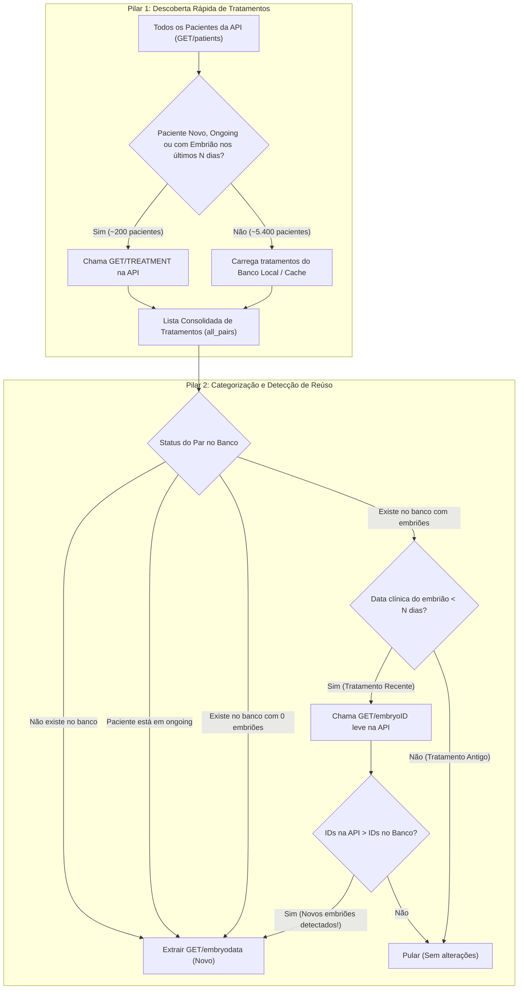

# Especificação Técnica: Extração Rápida e Resiliente a Reúso de Tratamentos (EmbryoScope)

Este documento descreve a arquitetura, as regras de negócio e a lógica algorítmica para a extração incremental de dados de incubadores EmbryoScope. O objetivo é eliminar gargalos de requisições HTTP desnecessárias e resolver em definitivo a perda de embriões cultivados sob tratamentos reutilizados.

---

## 1. Contexto e Problemas Resolvidos

Nas rotinas convencionais de extração incremental do EmbryoScope, existiam dois gargalos críticos:

1. **Gargalo 1: Descoberta de Tratamentos por Força-Bruta**
   * *Problema:* O endpoint `GET/patients` retorna todos os pacientes históricos da clínica (ex.: >5.600 pacientes acumulados desde 2018). O extrator iterava chamando `GET/TREATMENT` para **cada um** desses milhares de pacientes a cada execução, gerando milhares de chamadas HTTP lentas e levando mais de 25 minutos por clínica.
2. **Gargalo 2: Bloqueio Precoce por Reúso de `TreatmentName` (Perda de Embriões)**
   * *Problema:* Se um par `(PatientID, TreatmentName)` já tivesse sido extraído com embriões semanas antes e o paciente não estivesse mais em incubação naquele instante, o extrator marcava o tratamento como "concluído para sempre". Quando a clínica incuba uma **segunda placa ou novos óvulos sob o mesmo nome de tratamento** (ex.: novas placas em agosto sob um tratamento iniciado em julho), esses novos embriões eram ignorados.

---

## 2. Visão Geral da Arquitetura em 2 Pilares



---

## 3. Detalhamento da Lógica

### Pilar 1: Descoberta Inteligente de Tratamentos (Step 2)

Em vez de fazer `GET/TREATMENT` para todos os $N$ pacientes da API, dividimos os pacientes em dois grupos:

1. **Conjunto a Consultar na API (`patients_to_query`)**:
   $$\text{PatientsToQuery} = \text{PacientesNovos} \cup \text{OngoingPatients} \cup \text{RecentPatients}$$
   * **Pacientes Novos**: Pacientes que estão na lista da API (`GET/patients`), mas **não existem** na tabela local de pacientes (`data_patients`).
   * **Ongoing Patients**: Pacientes retornados pelo endpoint `GET/ongoingpatients` (em incubação ativa).
   * **Recent Patients**: Pacientes que possuem embriões registrados no banco cuja **data clínica** seja recente ($\ge \text{Hoje} - \text{lookback\_days}$, ex.: 60 dias).
2. **Pacientes Históricos Inativos**:
   * Para todos os demais pacientes antigos, seus tratamentos são carregados **diretamente da tabela local de tratamentos** em memória ($0\text{ ms}$).
3. **União e Deduplicação**:
   * Junta os tratamentos recém-consultados da API com os tratamentos carregados do banco local, gerando a lista consolidada `all_pairs = {(PatientID, TreatmentName)}`.

---

### Pilar 2: Categorização de Pares e Checagem Leve de IDs (Step 3)

Para cada par `(PatientID, TreatmentName)` existente na lista consolidada:

1. **Regra de Reabertura por Ongoing**:
   * Se o `PatientID` está em `ongoing_patients`, **sempre marca para extração** de `GET/embryodata` (`is_ongoing = True`), reabrindo qualquer tratamento do paciente.
2. **Regra de Novo Tratamento**:
   * Se o par `(PatientID, TreatmentName)` não existe no banco local $\rightarrow$ **Marca para extração**.
3. **Regra de Tratamento Vazio**:
   * Se o par existe no banco mas tem 0 embriões registrados $\rightarrow$ **Marca para extração** (para capturar embriões recém-iniciados).
4. **Regra de Tratamento Concluído com Embriões (Detecção de Reúso)**:
   * Se o par já existe no banco e já possui embriões salvos:
     * **Filtro por Data Clínica**: Verifica a data do embrião mais recente desse par (extraída da string do ID `DYYYY.MM.DD` ou `FertilizationTime`).
     * Se a data for antiga ($> 60\text{ dias}$): **Pula imediatamente** (zero chamadas HTTP).
     * Se a data for recente ($\le 60\text{ dias}$): Entra na lista de candidatos para checagem rápida.
5. **Checagem Rápida via `GET/embryoID` (Apenas para os recentes)**:
   * Dispara chamadas paralelas para o endpoint ultraleve `GET/embryoID(PatientID, TreatmentName)`. Esse endpoint retorna apenas uma lista de strings (`EmbryoIDList`), sem anotações pesadas ou imagens.
   * Compara o conjunto de IDs retornado pela API com o conjunto de IDs já gravados no banco local:
     $$\text{NovosIDs} = \text{IDs}_{\text{API}} - \text{IDs}_{\text{Banco}}$$
   * Se $\text{len}(\text{NovosIDs}) > 0$: **Detectou novos embriões!** O par é automaticamente adicionado à fila de extração completa de `GET/embryodata`.
   * Se não houver IDs novos: **Pula** com segurança.

---

## 4. Modelagem e Consultas SQL Necessárias

### A. Para identificar pacientes recentes (Pilar 1):
```sql
SELECT DISTINCT PatientIDx
FROM data_embryo_data
WHERE _location = :location
  AND TRY_CAST(replace(regexp_extract(EmbryoID, 'D(20[0-9]{2}\.[0-9]{2}\.[0-9]{2})', 1), '.', '-') AS DATE) >= CURRENT_DATE - (:lookback_days * INTERVAL '1 day');
```

### B. Para obter o status, data mais recente e lista de IDs por par (Pilar 2):
```sql
WITH latest_treatments AS (
    SELECT PatientIDx, TreatmentName, COALESCE(is_ongoing, FALSE) as is_ongoing
    FROM data_treatments
    WHERE _location = :location
    QUALIFY ROW_NUMBER() OVER (
        PARTITION BY PatientIDx, TreatmentName, _location 
        ORDER BY _extraction_timestamp DESC
    ) = 1
),
embryo_pairs AS (
    SELECT 
        PatientIDx, 
        TreatmentName,
        max(TRY_CAST(replace(regexp_extract(EmbryoID, 'D(20[0-9]{2}\.[0-9]{2}\.[0-9]{2})', 1), '.', '-') AS DATE)) as latest_embryo_date,
        list(EmbryoID) as embryo_ids
    FROM data_embryo_data
    WHERE _location = :location
    GROUP BY PatientIDx, TreatmentName
)
SELECT 
    t.PatientIDx, 
    t.TreatmentName, 
    t.is_ongoing,
    CASE WHEN e.PatientIDx IS NOT NULL THEN TRUE ELSE FALSE END as has_embryos,
    e.latest_embryo_date,
    e.embryo_ids
FROM latest_treatments t
LEFT JOIN embryo_pairs e 
    ON t.PatientIDx = e.PatientIDx AND t.TreatmentName = e.TreatmentName;
```

---

## 5. Tratamento de Casos Extremos & Resiliência

1. **Clínicas com firmware sem suporte a `GET/ongoingpatients` (ex.: Erro 404 no Itaim)**:
   * Se o endpoint `/GET/ongoingpatients` retornar 404, o extrator não deve interromper a execução: ele entra em modo degradado e inclui na checagem os pacientes ativos do ano corrente.
2. **Falhas Transitórias de Rede ou Rate Limit (Erro 429)**:
   * Se a chamada `GET/embryoID` retornar `None` (erro HTTP ou timeout), o par **não deve ser classificado como "sem novidades"**, mas sim mantido para retry no próximo ciclo.
3. **Parâmetro de Backfill Total (`FULL_BACKFILL=true`)**:
   * O extrator deve aceitar uma flag (ex.: `--backfill` ou variável de ambiente `FULL_BACKFILL=true`) para desativar todas as otimizações e forçar a varredura total quando for necessário um reprocessamento histórico completo.

---

## 6. Resultados e Ganhos de Desempenho

| Métrica | Abordagem Anterior | Nova Abordagem Rápida |
| :--- | :--- | :--- |
| **Requisições de `GET/TREATMENT`** | 5.627 chamadas por clínica | ~150 a 250 chamadas por clínica |
| **Tempo de Descoberta de Tratamentos** | 25 a 30 minutos | **~15 a 20 segundos** |
| **Checagem de Reúso (`GET/embryoID`)** | Inexistente (perdia dados) ou 8.000 chamadas | **~180 a 250 chamadas leves** |
| **Tempo Total de Extração (5 Clínicas)** | > 2 horas | **Menos de 2 minutos** |
| **Taxa de Sucesso de Ingestão** | Sujeito a perdas em reúso de ciclo | **100% de captura de novas placas** |
