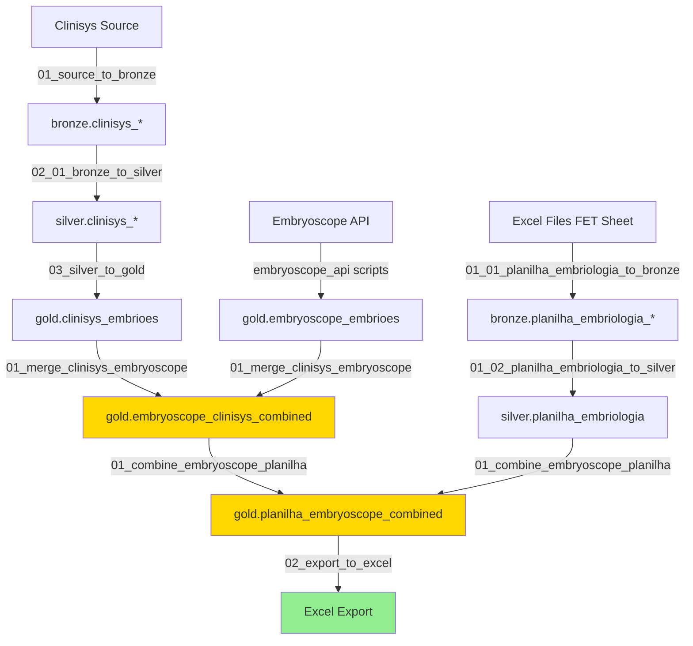

# Pipeline Dependencies for Export Script

This document tracks all scripts necessary to achieve the results in `02_export_to_excel.py`.

## Overview

The export script reads from `gold.planilha_embryoscope_combined` table, which is created by joining two major data sources:
1. **Embryoscope + Clinisys data** → `gold.embryoscope_clinisys_combined`
2. **Planilha Embriologia data** → `silver.planilha_embriologia`

## Complete Pipeline Execution Order

### Phase 1: Clinisys Data Pipeline

**Location**: `clinisys/`

1. **`01_source_to_bronze.py`**
   - Reads raw Clinisys data from source
   - Creates `bronze.clinisys_*` tables

2. **`02_01_bronze_to_silver.py`**
   - Transforms bronze data
   - Creates `silver.clinisys_*` tables

3. **`03_silver_to_gold.py`**
   - Creates `gold.clinisys_embrioes` table
   - Joins and enriches silver layer data
   - **Note**: Applies prefixes (`oocito_`, `micro_`, `cong_em_`, `descong_em_`, `emb_cong_`, `trat_`) to prevent column name conflicts

### Phase 2: Embryoscope Data Pipeline

**Location**: `embryoscope_api/`

Scripts that extract data from Embryoscope API and create `gold.embryoscope_embrioes` table.

### Phase 3: Merge Embryoscope + Clinisys

**Location**: `data_lake_scripts/`

4. **`01_merge_clinisys_embryoscope.py`**
   - **Input**: `gold.clinisys_embrioes` + `gold.embryoscope_embrioes`
   - **Output**: `gold.embryoscope_clinisys_combined`
   - **Join conditions**:
     - `micro_Data_DL = DATE(embryo_FertilizationTime)`
     - `micro_prontuario = prontuario`
     - `oocito_embryo_number = embryo_embryo_number`

### Phase 4: Planilha Embriologia Pipeline

**Location**: `planilha_embriologia/`

5. **`01_01_planilha_embriologia_to_bronze.py`**
   - Reads Excel files from `planilha_embriologia/data_input/YYYY/` folders
   - Reads from "FET" sheet (header in row 2)
   - Creates `bronze.planilha_embriologia_*` tables (one per file)

6. **`01_02_planilha_embriologia_to_silver.py`**
   - Combines all bronze tables
   - Standardizes column names
   - Creates `silver.planilha_embriologia` table

### Phase 5: Combine All Data

**Location**: `planilha_embriologia/02_create_tables/`

7. **`01_combine_embryoscope_planilha.py`**
   - **Input**: `gold.embryoscope_clinisys_combined` + `silver.planilha_embriologia`
   - **Output**: `gold.planilha_embryoscope_combined`
   - **Join conditions**:
     - `micro_prontuario = PIN`
     - `DATE(descong_em_DataTransferencia) = DATE("DATA DA FET")`
   - Uses FULL OUTER JOIN to preserve all records
   - Adds `planilha_` prefix to columns from the spreadsheet

### Phase 6: Export to Excel

8. **`02_export_to_excel.py`** ⭐
   - **Input**: `gold.planilha_embryoscope_combined`
   - **Filter**: Only transferred embryos (`trat_data_transferencia IS NOT NULL OR planilha_DATA_DA_FET IS NOT NULL`)
   - **Configuration**: Uses `02_a_export_config.yml` to exclude specific columns (e.g., metadata)
   - **Processing**: Removes completely null columns and excluded columns
   - **Output**: Excel file with ~9,231 rows

#### Export Configuration
- **File**: `02_a_export_config.yml`
- **Purpose**: Defines columns to exclude from export
- **Format**:
  ```yaml
  exclude_columns:
    - planilha_line_number
    - planilha_extraction_timestamp
  exclude_patterns:
    - "_hash$"
  ```

## Quick Start Scripts

### Run Entire Pipeline

**Clinisys Pipeline**:
```bash
cd clinisys
00_run_dataflow_clinisys.bat
```

**Planilha Embriologia Pipeline**:
```bash
cd planilha_embriologia/01_data_ingestion
00_run_planilha_embriologia_pipeline.bat
```

**Merge and Export**:
```bash
# Merge embryoscope + clinisys
conda run -n try_request python data_lake_scripts/01_merge_clinisys_embryoscope.py

# Combine with planilha
conda run -n try_request python planilha_embriologia/02_create_tables/01_combine_embryoscope_planilha.py

# Export to Excel
conda run -n try_request python planilha_embriologia/02_create_tables/02_export_to_excel.py
```

## Troubleshooting: Column Duplicates (`_1` suffixes)

If the exported Excel file contains columns with `_1` suffixes (e.g., `Ciclo_1`), it indicates a column aliasing conflict or stale data.

**Resolution:**
Rebuild the pipeline tables from scratch by running the Merge and Export commands listed above. The current scripts correctly handle aliasing with prefixes (`c_`, `e_`, `p_`, etc.).

## Data Flow Diagram


