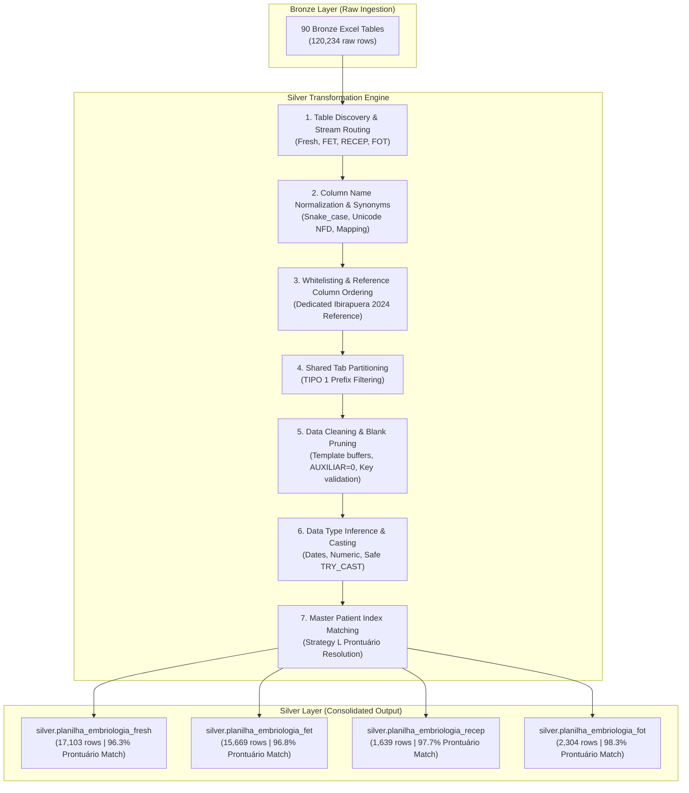

# Technical Specification: Silver Layer Consolidation Pipeline
### `planilha_embriologia` $\rightarrow$ `silver.planilha_embriologia_{fresh, fet, recep, fot}`

This document provides the complete, end-to-end engineering specification of all transformations implemented in the Silver layer. It is designed to allow exact reproduction in production (e.g., AWS Glue, Athena, Databricks, Snowflake, or DuckDB).

---

## 1. High-Level Pipeline Architecture



---

## 2. Step-by-Step Transformation Logic

### Step 1: Bronze Table Discovery & Routing

All tables in schema `bronze` matching `planilha_%` across target cohorts (`2021`–`2026`) are routed to the 4 target streams based on naming patterns:

```python
YEARS_TO_PROCESS = ['2021', '2022', '2023', '2024', '2025', '2026']

# Discovery rules per sheet type:
# Shared pattern matches multi-type workbooks from 2021-2023
shared_condition = "(table_name LIKE '%_total%' OR table_name LIKE '%_geral%' OR table_name LIKE '%_anual%' OR table_name LIKE '%_2022' OR table_name LIKE '%_sheet1')"

if sheet_type == 'fresh':
    condition = f"(table_name LIKE '%_fresh' OR table_name LIKE '%_fiv' OR {shared_condition})"
elif sheet_type == 'fet':
    condition = f"(table_name LIKE '%_fet' OR table_name LIKE '%_tec' OR {shared_condition})"
elif sheet_type == 'recep':
    condition = f"(table_name LIKE '%_recep' OR {shared_condition})"
elif sheet_type == 'fot':
    condition = f"(table_name LIKE '%_fot' OR {shared_condition})"
```

---

### Step 2: Column Normalization & Synonym Mapping

Raw Excel columns have irregular casings, spaces, accents, and Brazilian Portuguese synonyms. Every column name undergoes a 6-step normalization pipeline:

1. **Whitespace Collapsing**: Replaces internal tabs/newlines with a single space and strips ends.
2. **Diacritic Stripping**: Decomposes Unicode diacritics (`unicodedata.normalize('NFD')`) and strips non-spacing marks (e.g. `PUNÇÃO` $\rightarrow$ `PUNCAO`, `ÓVULO` $\rightarrow$ `OVULO`).
3. **Case Normalization**: Converts all characters to lowercase.
4. **Snake Case Conversion**: Replaces any non-alphanumeric character with an underscore (`[^a-z0-9]` $\rightarrow$ `_`).
5. **Underscore Deduping**: Collapses consecutive underscores (`__` $\rightarrow$ `_`).
6. **Canonical Synonym Mapping**: Resolves historical header variants to standard target keys:

```python
SYNONYMS = {
    # Clinical Outcomes
    'resultado': 'result',
    'beta': 'result',
    'tipo_resultado': 'tipo_do_resultado',
    'tipo_de_resultado': 'tipo_do_resultado',
    'gravidez_clinica': 'gravidez_clinica',
    'gravidez_bioquimica': 'gravidez_bioquimica',
    'n_nascidos': 'no_nascidos',
    'num_nascidos': 'no_nascidos',
    'no_nascidos': 'no_nascidos',
    'na_nascidos': 'no_nascidos',
    'n_o_nascidos': 'no_nascidos',
    'data_parto': 'data_parto',
    'tipo_parto': 'tipo_de_parto',
    'tipo_de_parto': 'tipo_de_parto',
    'peso_1': 'peso_1',
    'peso_2': 'peso_2',
    
    # Procedure Dates & Flags
    'data_transferencia': 'data_da_fet',
    'data_da_transferencia': 'data_da_fet',
    'data_do_fot': 'data_do_procedimento',
    'data_do_procedimento': 'data_do_procedimento',
    'data_procedimento': 'data_do_procedimento',
    'data_da_coleta': 'data_da_puncao',
    'data_cong': 'data_crio',
    'data_cryo': 'data_crio',
    'data_crio_embriao': 'data_crio',
    'data_crio_embrioes': 'data_crio',
    'dia_crio': 'dia_cryo',
    'houve_transferencia': 'houve_transferencia',
    'houve_transf': 'houve_transferencia',
    'transf': 'no_et',
    'n_et': 'no_et',
    'num_et': 'no_et',
    'n_da_transfer': 'no_da_transfer_1a_2a_3a',
    'numero_da_transfer_1a_2a_3a': 'no_da_transfer_1a_2a_3a',
    
    # Patient Demographics
    'nome': 'nome_da_paciente',
    'paciente': 'nome_da_paciente',
    'nasc': 'data_de_nasc',
    'data_nasc': 'data_de_nasc',
    'prontuario': 'pin',
    'pronturio': 'pin',
    'idade': 'idade_mulher',
    'idade_da_mulher': 'idade_mulher',
    'idade_do_esperma': 'idade_espermatozoide',
    
    # Embryology Metrics
    'blast': 'qtd_blasto',
    'blasto': 'qtd_blasto',
    'normais': 'qtd_normais',
    'n_biopsiados': 'no_biopsiados',
    'n_analisados': 'qtd_analisados',
    'causa': 'fator_1',
    'incub': 'incubadora',
    'incub_d5': 'incubadora',
    'tipo_de_tratamento': 'tipo_1',
    'tipo_de_inseminacao_ou_icsi': 'tipo_de_inseminacao',
    'tipo_inseminacao': 'tipo_de_inseminacao',
    'tipo_da_doacao_recepcao': 'tipo_da_doacao',
}
```

---

### Step 3: Column Whitelisting & Canonical Schemas

Only whitelisted columns are retained in Silver. Unnecessary calculation columns and Excel formatting artifacts are dropped.

#### **Canonical Column Specifications by Table**:

| Table Name | Core Columns Included in Silver |
| :--- | :--- |
| **`silver.planilha_embriologia_fresh`** | `pin`, `nome_da_paciente`, `data_de_nasc`, `data_da_puncao`, `data_crio`, `data_da_fet`, `tipo_1`, `tipo_de_inseminacao`, `tipo_biopsia`, `fator_1`, `incubadora`, `opu`, `total_de_mii`, `qtd_blasto`, `qtd_blasto_tq_a_e_b`, `no_biopsiados`, `qtd_analisados`, `qtd_normais`, `dia_cryo`, `dia_et`, `no_et`, `houve_transferencia`, `result`, `tipo_do_resultado`, `gravidez_clinica`, `gravidez_bioquimica`, `no_nascidos`, `data_parto`, `tipo_de_parto`, `peso_1`, `file_name`, `sheet_name`, `prontuario` |
| **`silver.planilha_embriologia_fet`** | `pin`, `nome_da_paciente`, `data_de_nasc`, `data_da_fet`, `data_crio`, `tipo_1`, `tipo_de_fet`, `tipo_biopsia`, `tipo_da_doacao`, `idade_mulher`, `idade_do_cong_de_embriao`, `preparo_para_transferencia`, `dia_cryo`, `no_da_transfer_1a_2a_3a`, `dia_et`, `no_et`, `houve_transferencia`, `result`, `tipo_do_resultado`, `gravidez_clinica`, `gravidez_bioquimica`, `no_nascidos`, `data_parto`, `tipo_de_parto`, `peso_1`, `peso_2`, `obs`, `file_name`, `sheet_name`, `prontuario` |
| **`silver.planilha_embriologia_recep`** | `pin`, `nome_da_paciente`, `data_de_nasc`, `data_da_fet`, `data_do_procedimento`, `pin_doadora`, `data_crio`, `tipo_1`, `tipo_biopsia`, `tipo_da_doacao`, `idade_mulher`, `idade_do_cong_de_embriao`, `preparo_para_transferencia`, `dia_cryo`, `no_da_transfer_1a_2a_3a`, `dia_et`, `no_et`, `houve_transferencia`, `tipo_do_resultado`, `gravidez_clinica`, `gravidez_bioquimica`, `no_nascidos`, `data_parto`, `tipo_de_parto`, `peso_1`, `obs`, `file_name`, `sheet_name`, `prontuario` |
| **`silver.planilha_embriologia_fot`** | `pin`, `nome_da_paciente`, `data_de_nasc`, `data_do_procedimento`, `data_da_puncao`, `data_crio`, `data_da_fet`, `tipo_1`, `tipo_de_inseminacao`, `tipo_biopsia`, `fator_1`, `incubadora`, `total_de_mii`, `qtd_blasto`, `dia_cryo`, `houve_transferencia`, `result`, `tipo_do_resultado`, `gravidez_clinica`, `gravidez_bioquimica`, `no_nascidos`, `data_parto`, `tipo_de_parto`, `file_name`, `sheet_name`, `prontuario` |

---

### Step 4: Shared Tab Partitioning (TIPO 1 Prefix Matching)

For multi-type annual files (2021–2023), rows are partitioned based on prefix matching on column `tipo_1`:

```python
TIPO_FILTERS = {
    'fresh': ['FIC/ICSI', 'FIV/ICSI', 'FRESH', 'ICSI', 'FIV', 'CONG', 'OR', 'PUNÇÃO', 'PUNCAO'],
    'fet':   ['FET', 'FET/OR', 'FET/ER', 'TEC', 'DESCONG EMBRIAO', 'DESCONG EMBRIÃO'],
    'recep': ['RECEPTORA', 'RECEP', 'DOAÇÃO', 'DOACAO', 'RECEPT'],
    'fot':   ['FOT', 'FOT OR', 'DESCONG OVO', 'DESCONG OVULO', 'DESCONG ÓVULO']
}

# Applied during reading:
if is_shared_table and 'tipo_1' in df.columns:
    allowed = TIPO_FILTERS[sheet_type]
    df = df[df['tipo_1'].fillna('').apply(lambda x: any(str(x).upper().strip().startswith(p) for p in allowed))]
```

---

### Step 5: Data Cleaning & Blank Pruning (`clean_data`)

To eliminate the ~78,000 empty buffer rows inherited from raw Excel templates, three filtering rules are applied sequentially:

```python
def clean_data(df, sheet_type):
    # Rule 1: Exclude template calculation placeholders
    if 'auxiliar' in df.columns:
        df = df[~((df['auxiliar'] == 0) | (df['auxiliar'] == '0'))]
        
    # Rule 2: Exclude rows where ALL data columns are empty/whitespace
    data_cols = [c for c in df.columns if c not in ['file_name', 'sheet_name', 'line_number', 'extraction_timestamp']]
    df = df[df[data_cols].apply(lambda row: not all(is_blank(v) for v in row), axis=1)]
    
    # Rule 3: Exclude rows missing BOTH PIN and the primary procedure date
    if sheet_type.upper() in ['FRESH', 'FOT']:
        date_col = find_col(df, ['data_da_puncao', 'data_do_procedimento', 'data_crio'])
    else:
        date_col = find_col(df, ['data_da_fet', 'data_do_procedimento', 'data_crio'])
        
    df = df[~(df['pin'].apply(is_blank) & df[date_col].apply(is_blank))]
    return df
```

---

### Step 6: Data Type Inference & Casting

Every column is typed explicitly using production casting rules:

1. **Date Columns** (`data_da_puncao`, `data_da_fet`, `data_crio`, `data_de_nasc`, `data_parto`, `data_do_procedimento`):
   - Handled with safe date parsing (`TRY_CAST(val AS DATE)` / `pd.to_datetime(val, errors='coerce')`).
2. **Numeric Columns** (`no_et`, `no_nascidos`, `qtd_blasto`, `total_de_mii`, `qtd_normais`, `peso_1`):
   - Stripped of commas and whitespace, rounded, and cast to `BIGINT` or `DOUBLE`.
3. **Audit Metadata**:
   - `file_name VARCHAR` (source Excel filename)
   - `sheet_name VARCHAR` (source worksheet tab)
   - `prontuario BIGINT` (resolved EMR master chart number)

---

### Step 7: Master Patient Index Resolution (Strategy L)

To guarantee that lab spreadsheets link accurately to Clinisys EMR records, each Silver table is enriched with the canonical **`prontuario`** using the multi-tier **Strategy L engine** ([`commons/prontuario_matching_v1.py`](file:///g:/My%20Drive/projetos_individuais/Huntington/commons/prontuario_matching_v1.py)):

```text
Matching Hierarchy:
├── Tier 1 (CPF Exact Match):
│   Clean 11-digit CPF match against clinisys_all.silver.view_pacientes (excluding test/dummy CPFs).
│
├── Tier 2 (ID + Birthdate Match):
│   Spreadsheet PIN == Clinisys codigo AND data_de_nasc == data_nascimento.
│
├── Tier 3 (Direct ID Match with Name Similarity Scoring):
│   Spreadsheet PIN == Clinisys codigo with Levenshtein <= 1, Jaro-Winkler >= 0.72, and gender safeguards.
│
└── Tier 4 (Spousal / Partner Link Match):
    Spreadsheet PIN matched against prontuario_marido, prontuario_esposa, or prontuario_responsavel1/2.
```

**Resulting Prontuário Match Performance in Silver:**
- `silver.planilha_embriologia_fresh`: **96.3%**
- `silver.planilha_embriologia_fet`: **96.8%**
- `silver.planilha_embriologia_recep`: **97.7%**
- `silver.planilha_embriologia_fot`: **98.3%**

---

## 3. Production Deployment Guidelines

When running in production (e.g. AWS Glue ETL job):
1. **Input Dependencies**: Bronze tables must be created first by `01_planilha_embriologia_to_bronze.py`.
2. **Execution Command**:
   ```bash
   python planilha_embriologia/01_data_ingestion/02_planilha_embriologia_to_silver.py
   ```
3. **Downstream Execution**:
   After Silver completes, run `05_create_gold_clinisys_embrioes_outcomes.py` to materialize `gold.clinisys_embrioes_outcomes`.
4. **Idempotence**:
   All table creations use `DROP TABLE IF EXISTS` and atomic inserts, guaranteeing 100% idempotent and deterministic execution.
