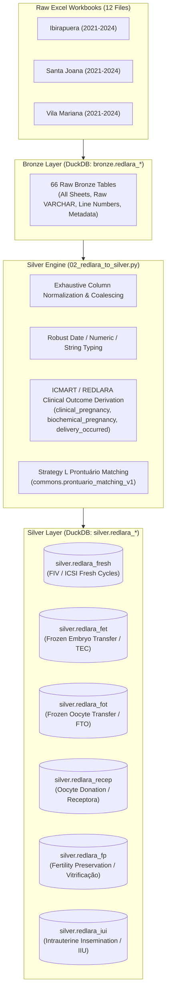

# REDLARA Silver Transformation Specification

### Local DuckDB Silver Layer: `silver.redlara_*`
**Version**: 1.0.0  
**Target Database**: `database/huntington_data_lake.duckdb`  
**Matching Database**: `database/clinisys_all.duckdb` (`silver.view_pacientes`)  

---

## 📌 Executive Summary & Architecture Overview

This specification formalizes the transformation of the raw Latin American Registry of Assisted Reproduction (REDLARA) Excel workbooks into **6 dedicated, procedure-level Silver tables** in DuckDB, fully aligned with the architectural design proven in `planilha_embriologia`.



---

## 📂 Source Inventory & Ingestion Rules

The data input directory contains 12 multi-sheet Excel files across 3 clinics and 4 calendar years:
- `data_input/Ibirapuera/{2021, 2022, 2023, 2024}/redlara_ibirapuera_YYYY.xlsx`
- `data_input/Santa Joana/{2021, 2022, 2023, 2024}/redlara_sj_YYYY.xlsx`
- `data_input/Vila Mariana/{2021, 2022, 2023, 2024}/redlara_vm_YYYY.xlsx`

### Sheet Classification Logic:
| Procedure Stream | Sheet Pattern Regex | Target Bronze Table Pattern | Target Silver Table |
| :--- | :--- | :--- | :--- |
| **FRESH** | `^(FRESH\|FIV)` | `bronze.redlara_{unidade}_{year}_fresh` | `silver.redlara_fresh` |
| **FET** | `^(FET\|TEC)` | `bronze.redlara_{unidade}_{year}_fet` | `silver.redlara_fet` |
| **FOT** | `^(FTO\|FOT)` | `bronze.redlara_{unidade}_{year}_fot` | `silver.redlara_fot` |
| **RECEP** | `^(RECEP\|OD\|OR)` | `bronze.redlara_{unidade}_{year}_recep` | `silver.redlara_recep` |
| **FP** | `^FP` | `bronze.redlara_{unidade}_{year}_fp` | `silver.redlara_fp` |
| **IUI** | `^(IUI\|IIU)` | `bronze.redlara_{unidade}_{year}_iui` | `silver.redlara_iui` |

*Non-data sheets (e.g., `Folha1` in Santa Joana 2024) are systematically dropped during ingestion.*

---

## 🩺 Clinical Pregnancy Outcome Modeling

Following the **ICMART / REDLARA International Assisted Reproduction Definitions**, the Silver transformation derives standardized binary outcome indicators:

### 1. Clinical Pregnancy (`clinical_pregnancy: VARCHAR ('1' / '0' / NULL)`)
```sql
CASE
    -- Definite Positive Clinical Pregnancy:
    WHEN COALESCE(gestational_sacs_first_us, 0) >= 1
         OR COALESCE(gestational_sacs_second_us, 0) >= 1
         OR COALESCE(number_of_newborns, 0) >= 1
         OR date_of_delivery IS NOT NULL
         OR UPPER(TRIM(COALESCE(outcome_type, ''))) LIKE '%DELIVERY%'
         OR UPPER(TRIM(COALESCE(outcome, ''))) LIKE '%DELIVERY%'
         OR UPPER(TRIM(COALESCE(outcome_type, ''))) LIKE '%MISCARRIAGE%'
         OR UPPER(TRIM(COALESCE(outcome, ''))) LIKE '%MISCARRIAGE%'
         OR UPPER(TRIM(COALESCE(outcome_type, ''))) LIKE '%MISCARRIED%'
         OR UPPER(TRIM(COALESCE(outcome, ''))) LIKE '%MISCARRIED%'
         OR UPPER(TRIM(COALESCE(outcome_type, ''))) LIKE '%CLINICAL PREGNANCY%'
         OR UPPER(TRIM(COALESCE(outcome, ''))) LIKE '%CLINICAL PREGNANCY%'
         OR UPPER(TRIM(COALESCE(outcome_type, ''))) LIKE '%ECTOPIC%'
         OR UPPER(TRIM(COALESCE(outcome, ''))) LIKE '%ECTOPIC%'
         OR UPPER(TRIM(COALESCE(outcome, ''))) IN ('POSITIVO')
    THEN '1'
    
    -- Evaluated Transfer with Negative Outcome:
    WHEN (
            UPPER(TRIM(COALESCE(outcome, ''))) LIKE '%TRANSFER%'
            OR date_of_embryo_transfer IS NOT NULL
            OR COALESCE(number_of_embryos_transferred, 0) >= 1
            OR UPPER(TRIM(COALESCE(outcome, ''))) IN ('NO PREGNANCY', 'NEGATIVO')
         )
         AND (
            UPPER(TRIM(COALESCE(outcome_type, ''))) LIKE '%NO PREGNANCY%'
            OR UPPER(TRIM(COALESCE(outcome_type, ''))) LIKE '%BIOCHEMICAL%'
            OR UPPER(TRIM(COALESCE(outcome, ''))) LIKE '%BIOCHEMICAL%'
            OR UPPER(TRIM(COALESCE(outcome, ''))) IN ('NO PREGNANCY', 'NEGATIVO')
            OR UPPER(TRIM(COALESCE(outcome_type, ''))) IN ('SEM CONTATO', 'SEM RESPOSTA', 'RECUSA')
         )
    THEN '0'
    
    -- Non-Transfers (Freeze-all, Cancellations, Oocyte Preservations):
    ELSE NULL
END
```

### 2. Biochemical Pregnancy (`biochemical_pregnancy: VARCHAR ('1' / '0' / NULL)`)
- `'1'` if `outcome_type` or `outcome` indicates `'Biochemical pregnancy'` (transient positive hCG without clinical sac development).
- `'0'` if an embryo transfer took place with negative or clinical-only outcome.
- `NULL` if no transfer occurred.

### 3. Delivery Occurred (`delivery_occurred: VARCHAR ('1' / '0' / NULL)`)
- `'1'` if `date_of_delivery` is present, or `number_of_newborns >= 1`, or `outcome_type`/`outcome` contains `'Delivery'`.
- `'0'` if transfer occurred without delivery.
- `NULL` if no transfer occurred.

---

## 🏛️ Silver Tables Schema (Exhaustive Column Inventory)

### Primary Core Columns (Shared Across Transfer Tables):
| Column Name | Data Type | Description |
| :--- | :--- | :--- |
| `row_id` | `VARCHAR` | MD5 surrogate primary key (`file_name` + `sheet_name` + `line_number`) |
| `chart_or_pin` | `VARCHAR` | Raw clinic folder or patient PIN |
| `prontuario` | `BIGINT` | Clinisys Medical Record Number (resolved via Strategy L matching; `-1` if unmatched) |
| `patient_name` | `VARCHAR` | Patient full legal name |
| `date_of_birth` | `DATE` | Patient date of birth |
| `unidade` | `VARCHAR` | Clinic location (`Ibirapuera`, `Santa Joana`, `Vila Mariana`) |
| `year` | `BIGINT` | Reporting calendar year (2021–2024) |
| `doctor` | `VARCHAR` | Attending physician |
| `relationship_status` | `VARCHAR` | Marital / relationship status (e.g., `Woman - Man`, `Woman`) |
| `source_of_funding` | `VARCHAR` | Funding type (`Full out of pocket`, `Private insurance`) |
| `weight_kg` | `DOUBLE` | Patient body weight (kg) |
| `height_cm` | `DOUBLE` | Patient body height (cm) |
| `male_partner_age` | `BIGINT` | Age of male partner / sperm provider |
| `diagnosis_1` | `VARCHAR` | Primary infertility diagnosis |
| `diagnosis_2` | `VARCHAR` | Secondary infertility diagnosis |
| `initial_date` | `DATE` | Cycle start / stimulation start date |
| `date_of_embryo_transfer` | `DATE` | Embryo transfer date |
| `number_of_embryos_transferred`| `BIGINT` | Count of embryos transferred |
| `day_of_transfer` | `BIGINT` | Embryonic day of transfer (e.g., 3, 5) |
| `stage_at_transfer` | `VARCHAR` | Developmental stage at transfer (e.g., `Blastocyst`, `Cleavage`) |
| `preparation_for_transfer` | `VARCHAR` | Endometrial preparation protocol |
| `outcome` | `VARCHAR` | Primary REDLARA registry outcome |
| `outcome_type` | `VARCHAR` | Granular REDLARA outcome category |
| `clinical_pregnancy` | `VARCHAR` | Derived binary indicator: `'1'`, `'0'`, or `NULL` |
| `biochemical_pregnancy`| `VARCHAR` | Derived binary indicator: `'1'`, `'0'`, or `NULL` |
| `delivery_occurred` | `VARCHAR` | Derived delivery indicator: `'1'`, `'0'`, or `NULL` |
| `gestational_sacs_first_us` | `BIGINT` | Number of gestational sacs visualized on 1st ultrasound |
| `gestational_sacs_second_us`| `BIGINT` | Number of gestational sacs visualized on 2nd ultrasound |
| `number_of_newborns` | `BIGINT` | Total liveborn infants delivered |
| `date_of_delivery` | `DATE` | Delivery date |
| `gestational_age_at_delivery` | `BIGINT` | Gestational age at delivery (weeks) |
| `type_of_delivery` | `VARCHAR` | Mode of delivery (`Cesarean`, `Vaginal`) |
| `baby_1_weight` .. `baby_4_weight` | `DOUBLE` | Birth weight per infant (grams) |
| `baby_1_viability` | `VARCHAR` | Vital status of infant |
| `baby_1_congenital_abnormality`| `VARCHAR` | Congenital anomalies recorded |
| `pregnancy_complications`| `VARCHAR` | Obstetric complications recorded |
| `file_name` | `VARCHAR` | Origin Excel file name |
| `sheet_name` | `VARCHAR` | Origin Excel sheet tab name |
| `line_number` | `BIGINT` | Origin row index in Excel sheet |
| `bronze_source_table` | `VARCHAR` | Lineage pointer to Bronze table |

---

## 🔄 Pipeline Execution

Run the complete pipeline from Windows PowerShell:
```cmd
redlara\01_data_ingestion\00_run_redlara_pipeline.bat
```
This batch orchestrator sequentially executes:
1. `01_redlara_to_bronze.py`: Ingests all 12 workbooks (66 Bronze tables).
2. `02_redlara_to_silver.py`: Transforms to 6 Silver tables with type casting and Strategy L matching.
3. `03_generate_redlara_report.py`: Produces `silver_validation_report.md`.
